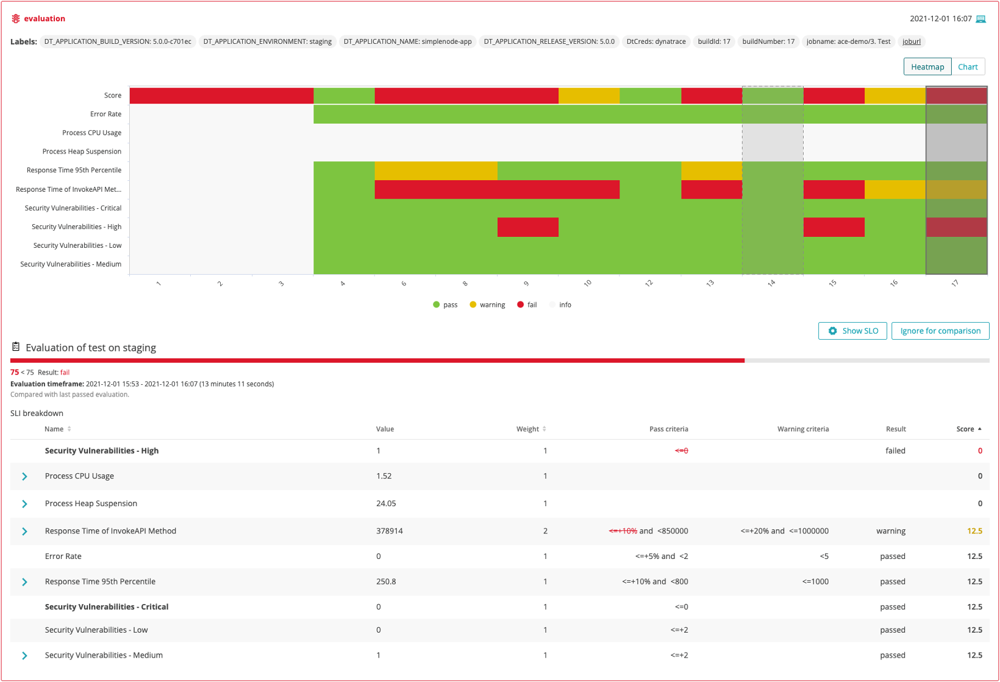

# AppSec Gate Demo
On top of the standard quality gate demo, which is based on performance metrics, there is now also an AppSec Gate demo flow.

A new build number `5` has been introduced.
When deploying this new build number, a security vulnerability will be introduced into the app which will be detected by Dynatrace's AppSec capability and stopped by a Quality Gate. 

## Components of AppSec Gate

### Vulnerability introduced in simplenodeservice

The `simplenodeservice` has a new build number `5` that introduces a security vulnerability.
See below code snippet. Check out `app.js` for the full version.

```javascript
switch(buildNumber) {
    ...
    case 5:
        // introduce HIGH appsec vulnerability
        var merge = require("@brikcss/merge")
        var obj = {}
        var malicious_payload = '{"__proto__":{"polluted":"Yes! Its Polluted"}}';
        console.log("Before: " + {}.polluted);
        merge({}, JSON.parse(malicious_payload));
        console.log("After : " + {}.polluted);
        break;
    ...
}
```

We introduce a HIGH vulnerability through Prototype Polution in build 5.
Check out https://security.snyk.io/vuln/SNYK-JS-BRIKCSSMERGE-1727594 for more details.

### Special appsec test pipeline
The `jenkins/test_appsec.Jenkinsfile` pipeline deviates from the standard test pipeline to accomodate for AppSec. The following changes were made:

#### Bypass current limitations

An extra stage was added that updates the `dynatrace-service` image that resolves a bug. Check out https://github.com/keptn-contrib/dynatrace-service/pull/616 for more information. In the final version of this usecase this step will be ommited.

Placeholders are set using `sed` since the `dynatrace-service` currently does not support standard keptn placeholders. Check out https://github.com/keptn-contrib/dynatrace-service/issues/601 for more information. In the final version of this usecase this step will be ommited.

```
stage('Security Gate PreReqs') {
    steps {
        container('helm') {
            // TEMP - Use special build that fixes https://github.com/keptn-contrib/dynatrace-service/pull/616
            sh "helm upgrade --install dynatrace-service -n keptn https://github.com/keptn-contrib/dynatrace-service/releases/download/0.18.1/dynatrace-service-0.18.1.tgz --set dynatraceService.image.tag=0.18.2-dev-PR-616"
        }
        container('git') {
            // TEMP - Generate sli files manually to cirumvent https://github.com/keptn-contrib/dynatrace-service/issues/601
            withCredentials([usernamePassword(credentialsId: 'git-creds-ace', passwordVariable: 'GIT_PASSWORD', usernameVariable: 'GIT_USERNAME')]) {
                sh "git config --global user.email ${env.GITHUB_USER_EMAIL}"
                sh "git clone ${env.GIT_PROTOCOL}://${GIT_USERNAME}:${GIT_PASSWORD}@${env.GIT_DOMAIN}/${env.GITHUB_ORGANIZATION}/${env.GIT_REPO}"
                sh "cd ${env.GIT_REPO}/ && sed -e 's|APP_BUILD_VERSION_PLACEHOLDER|${env.ART_VERSION}|' cloudautomation/sli_appsec.yaml > cloudautomation/sli_appsec_gen.yaml"
                sh "cd ${env.GIT_REPO}/ && git add cloudautomation/sli_appsec_gen.yaml && git commit -m 'Update sli for appsec'"
                sh "cd ${env.GIT_REPO}/ && git push ${env.GIT_PROTOCOL}://${GIT_USERNAME}:${GIT_PASSWORD}@${env.GIT_DOMAIN}/${env.GITHUB_ORGANIZATION}/${env.GIT_REPO}"
                //sh "rm -rf ${env.GIT_REPO}"
            }
        }
    }
}    
```

#### Extra wait time
Vulnerabilities are scanned every 15mins in AppSec. This means that additional wait time is needed to ensure that all vulnerabilities have been detected before evaluation the Quality Gate.

The following has been added to the pipeline
```
sleep(time:600,unit:"SECONDS")
```

### AppSec SLI and SLO files

Specific sli and slo definitions have been created under `cloudautomation/sli_appsec.yaml` and `cloudautomation/slo_appsec.yaml`.

CRITICAL, HIGH, MEDIUM and LOW vulnerabilities are separated. For HIGH and CRITICAL vulnerabilties we flag them as key_sli and they will stop the build.

`sli_appsec.yaml`
```yaml
app_sec_high:        "SECPV2;securityProblemSelector=riskLevel(HIGH),pgiTags([Environment]DT_APPLICATION_BUILD_VERSION:APP_BUILD_VERSION_PLACEHOLDER)"
app_sec_critical:    "SECPV2;securityProblemSelector=riskLevel(CRITICAL),pgiTags([Environment]DT_APPLICATION_BUILD_VERSION:APP_BUILD_VERSION_PLACEHOLDER)"
app_sec_medium:      "SECPV2;securityProblemSelector=riskLevel(MEDIUM),pgiTags([Environment]DT_APPLICATION_BUILD_VERSION:APP_BUILD_VERSION_PLACEHOLDER)"
app_sec_low:         "SECPV2;securityProblemSelector=riskLevel(LOW),pgiTags([Environment]DT_APPLICATION_BUILD_VERSION:APP_BUILD_VERSION_PLACEHOLDER)"
```

`slo_appsec.yaml`
```yaml
- sli: "app_sec_high"
  displayName: "Security Vulnerabilities - High"
  pass:
  - criteria:
      - <=0
  key_sli: true
- sli: "app_sec_critical"
  displayName: "Security Vulnerabilities - Critical"
  pass:
  - criteria:
      - <=0
  key_sli: true
- sli: "app_sec_medium"
  displayName: "Security Vulnerabilities - Medium"
  key_sli: false
  pass:
  - criteria:
      - <=+2
- sli: "app_sec_low"
  displayName: "Security Vulnerabilities - Low"
  key_sli: false
  pass:
  - criteria:
      - <=+2
```

## Result
After building build `5`, the evaluation will failed due to the introduced vulnerability:

